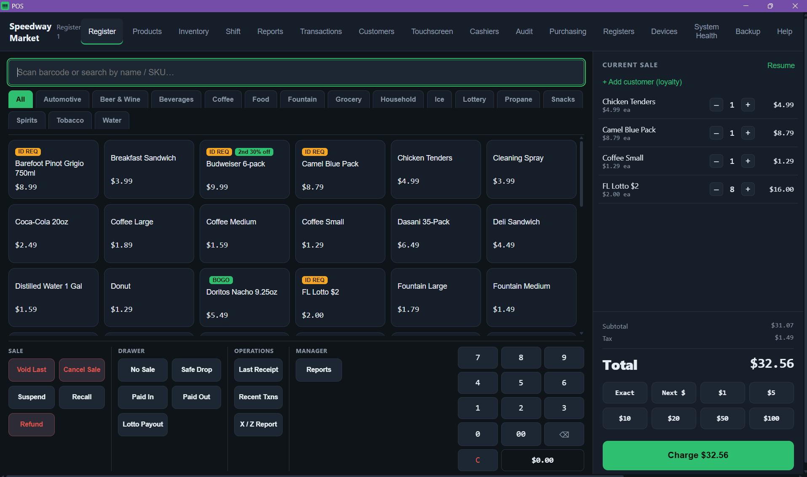
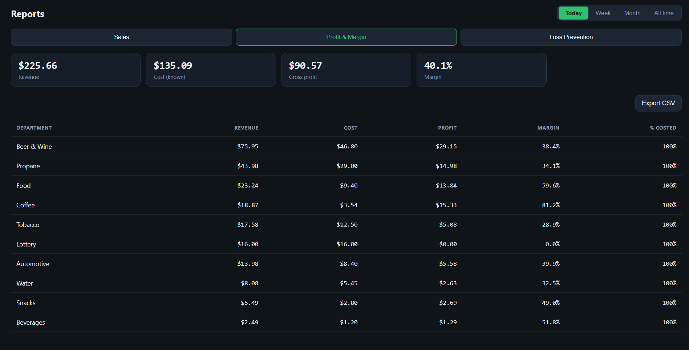
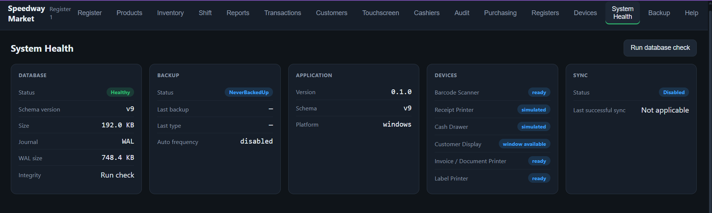
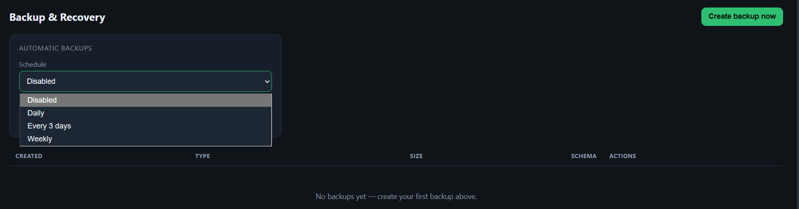

# Speedway POS

An offline-first point-of-sale system for convenience and liquor stores, built as a native desktop application in **Rust + Tauri + SQLite** with a **React/TypeScript** frontend. The backend is the source of truth for every financial calculation; the UI only expresses intent.

> **What this is:** a serious, working engineering project — a native POS with backend-authoritative money handling, atomic transactions, an append-only audit trail, historical cost accounting, hardware abstractions, purchasing, profit and loss-prevention reporting, and a safe backup/restore subsystem. Every business-logic invariant is covered by tests.
>
> **What this is not (yet):** a commercially deployed product. Payments are deliberately mocked (no PCI scope), hardware integrations are simulated behind real abstractions (no physical device has been driven), tax handling is intentionally non-jurisdictional, and no real store has run it on a live day of sales. See Honest scope below.

---

## Screenshots

| Register | Profit & margin report |
|---|---|
|  |  |

| System Health | Backup & Recovery |
|---|---|
|  |  |

---

## Why it is built this way

A point-of-sale system is mostly a trust problem: money must be correct, history must be tamper-evident, and the register must keep working when the network does not. The whole architecture follows from that.

- **The Rust backend is authoritative.** The frontend sends *intent* — product ids, quantities, tender type, a redeem flag — and never prices, totals, taxes, discounts, costs, or permissions. Every monetary value is recomputed and validated server-side. A tampered frontend cannot change a total or mint a discount.
- **Money is integer cents everywhere.** No floating-point money, ever. All pricing math lives in a pure, unit-tested Rust module.
- **One sale, refund, or void is one atomic SQLite transaction.** Items, payment, inventory, loyalty, and audit either all commit or all roll back.
- **History is append-only.** Inventory movements and the audit log are never updated or deleted. Editing a product cost today does not rewrite the margin on a sale from last week — historical cost is captured at the moment of sale.
- **Offline-first.** The register owns a local SQLite database and never blocks on a network. Backup, restore, health checks, and diagnostics all work with no internet connection.
- **Payments are honestly mocked.** Real card processing means PCI certification scope, which is deliberately out of bounds. The payment path is abstracted so a real provider can be integrated later without rewriting checkout.

## Features

**Register & checkout** — barcode/keyboard-wedge scanning, department-tabbed catalog, open-price entry, cart with promotions and age verification, cash/mocked-card tender with quick-tender buttons, change due, receipts, suspend/recall, self-checkout kiosk mode, and a customer-facing display.

**Cash & shifts** — PIN authentication (Argon2), cashier/manager/admin roles enforced in the backend, shift open/close with float and counted-cash reconciliation, drawer events (No Sale, Paid In/Out, Safe Drop, Lotto Payout), and over/short reporting.

**Inventory & purchasing** — product/catalog management with margins, vendors, purchase orders with receiving, case/pack to unit conversion, inventory adjustments with reason codes, product cost history, and reorder suggestions.

**Reporting** — sales, department, and payment breakdowns; historical-cost **profit & margin** reporting that honestly excludes lines with unknown cost rather than inventing it; a **loss-prevention** view (voids, refunds, no-sales, and over/short by cashier); and CSV export.

**Reliability** — SQLite-safe backups (VACUUM INTO), SHA-256 backup metadata and validation, configurable automatic backups with retention, a safety-backup-first restore workflow, a System Health page, database integrity checks, rotating application logs, and sanitized diagnostic export.

**Hardware (abstracted)** — a device layer with traits for receipt printer, cash drawer, customer display, and document/label printers; working simulated adapters; keyboard-wedge barcode scanning; A4/A5 invoice generation; and a Settings to Devices page. Native ESC/POS, serial, and HID adapters are a documented future integration point.

**Multi-register foundation** — each terminal is a register with a stable UUID; sales and shifts are stamped with register identity, and reports can be filtered per terminal. (Single store, multiple lanes — not multi-branch.)

## Tech stack

| Layer | Choice |
|---|---|
| Shell | Tauri 2 (native desktop) |
| Backend | Rust, sqlx |
| Database | SQLite (WAL, local, offline-first) |
| Frontend | React 18 + TypeScript, Zustand |
| Auth | Argon2 PIN hashing |
| Tests | Rust unit tests (pure business logic) |

By the numbers: 24 Rust modules, 20 React screens, 10 forward-only migrations, 71 Tauri commands, and 44 passing tests.

## Correctness, verified by tests

The test suite targets the invariants that actually matter in a POS. A sample of what is covered and passing:

- historical_cost_is_snapshot_not_reference — editing a product cost later never changes a completed sale recorded cost
- unit_cost_comes_from_product_not_frontend — the frontend cannot supply a line cost
- per_line_tax_sums_to_transaction_tax — per-line tax reconciles with the transaction total under the rounding policy
- pin_is_never_stored_in_plaintext / hash_then_verify_roundtrips — Argon2 auth
- cashier_blocked_from_manager_only_actions — backend permission enforcement
- drawer auto-open rules (cash opens, card-only does not, by default)
- three_cases_of_24_is_72_units — explicit pack/case conversion
- backup checksum determinism + change detection, and schema-compatibility gating

## Getting started

**Prerequisites:** Rust, Node.js 20+, and the Tauri prerequisites for your OS.

git clone https://github.com/Sriram-Mullapudi/speedway-pos.git
cd speedway-pos
npm install
npm run tauri dev
npm run tauri build
cargo test --manifest-path src-tauri/Cargo.toml

**Demo:** launch, sign in as Manager (PIN 2222), open Settings and reset demo data to seed a week of sales, then explore Reports, Shift, Purchasing, and System Health. (Demo PINs: Admin 1234, Manager 2222, Cashier 1111.)

A prebuilt Windows installer is attached to the latest release.

## Honest scope

This project is built with production-quality *architecture* while being clear about what has and has not been validated. Each area is classified honestly:

| Area | Status |
|---|---|
| Money/tax/promotion/loyalty logic | Implemented, unit-tested |
| Auth, roles, shifts, audit trail | Implemented, unit-tested |
| Backup creation & validation | Implemented, unit-tested; restore requires local validation |
| Restore / rollback | Implemented as a controlled restart; requires destructive-test caution |
| Hardware (printer, drawer, scanner, display) | Real abstractions + working simulated adapters; native devices not yet driven |
| Payments | Mocked — no processor, no PCI certification |
| Multi-register | Foundation implemented (identity + per-register reporting) |
| Multi-branch / sync | Not built — architecture kept sync-ready via stable UUIDs |
| Tax compliance | Deliberately non-jurisdictional; not legal advice |
| Real-store validation | None yet |

Turning this into a commercial product would require, at minimum: choosing and certifying a payment processor, validating against real hardware, jurisdiction-specific tax and legal review, and — most importantly — putting it in front of real store owners.

## Documentation

- ARCHITECTURE.md — system design and data model
- PORTFOLIO_NOTES.md — engineering decisions and trade-offs, phase by phase
